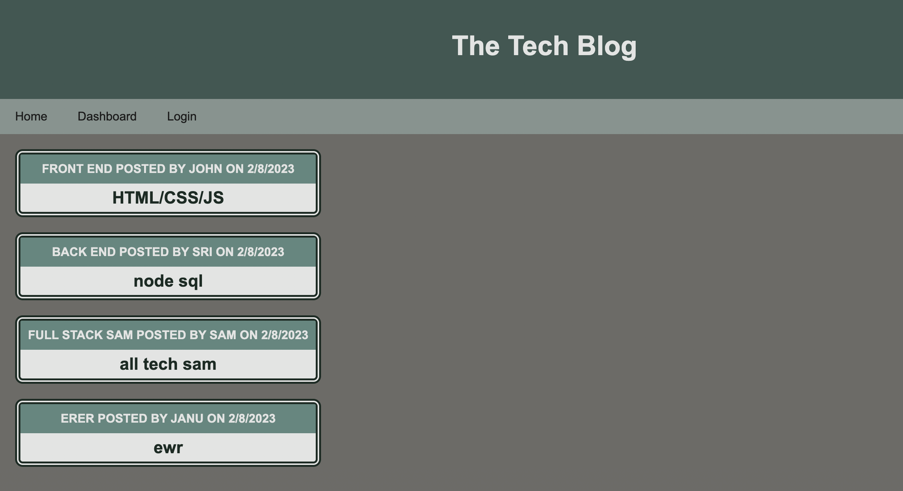
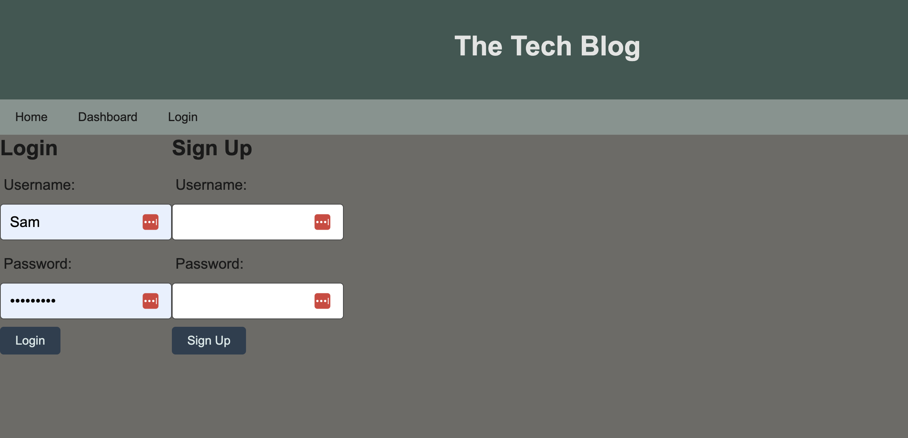
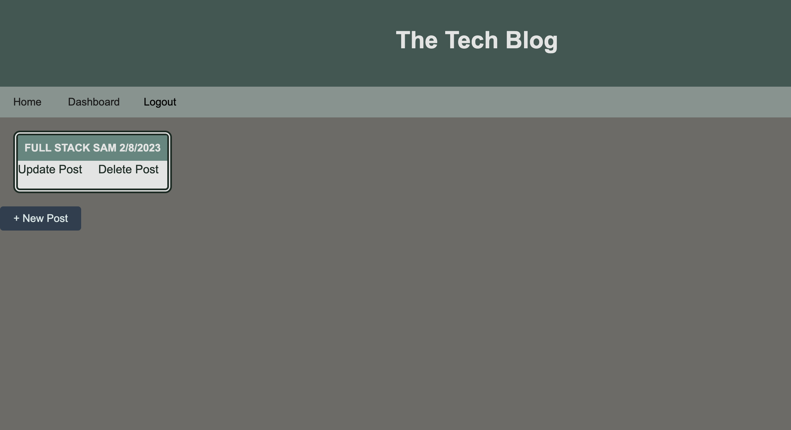
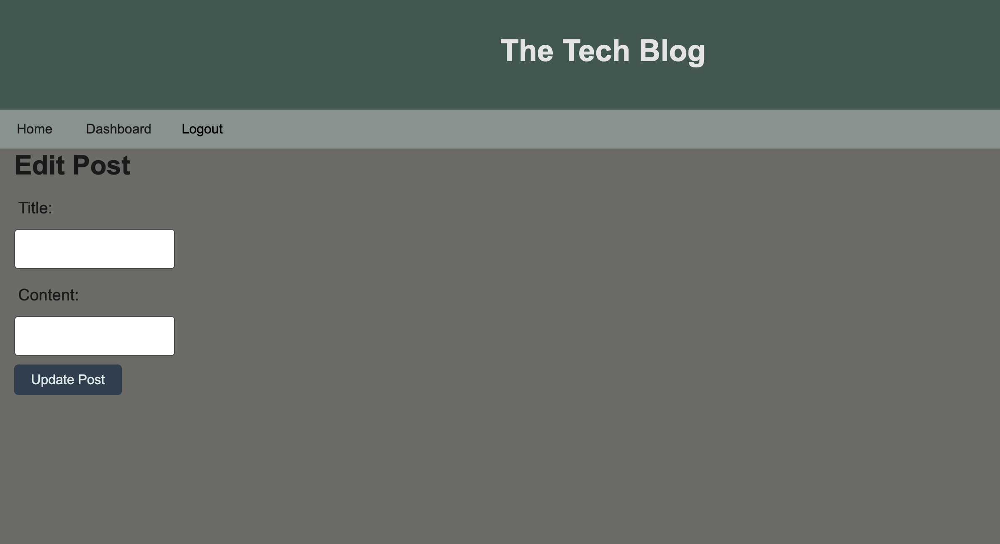
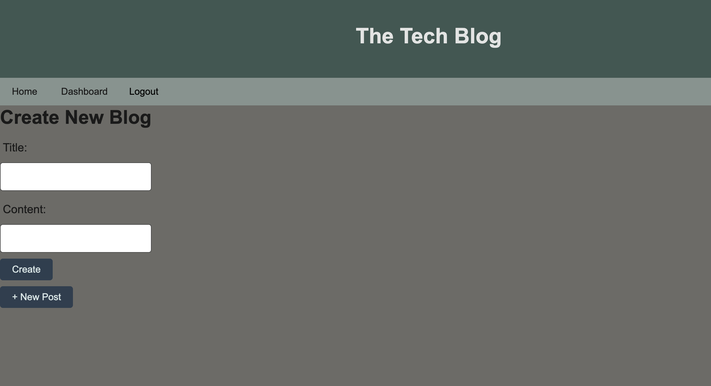
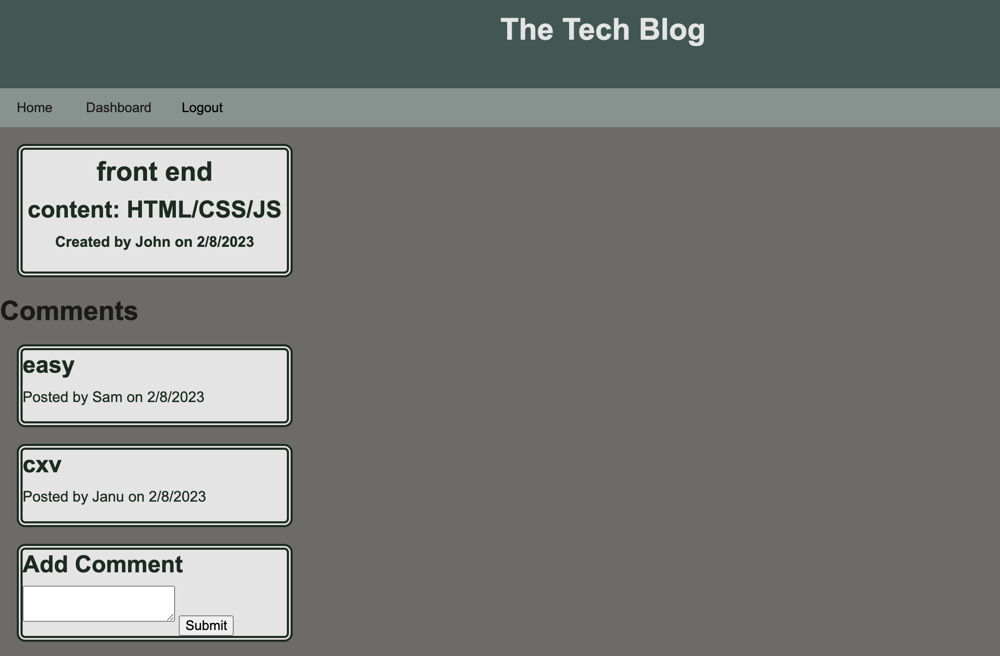

# Tech-Blog

## Description

This is a full stack application which allows users to post a blog, view other users blog and comment on their posts. This app is built using HTML/CSS/JS on the front end and Nodejs/expressJs, sequelize ORM , mysql and npm packages on the back end. It is built to meet the requirements of MVC paradigm and deployed using Heroku.

## Installation

1. Clone this repo.
2. Run `npm install`.
3. Edit the .env file with your environment details.
4. Run `npm start`.

## Usage

 On launch the app renders the homepage where users can see all the posts.

To access any other page the user has to login, so the login page will be displayed. If the user is not registered they can signup and then login.

Once logged in the user can access the dashboard where posts belonging to user are displayed with edit and delete options. 

The update post button renders a form with the post title and content to be updated.

Delete Post button deletes a specific post and refreshes the dashboard.

The user can also create a new post by clicking on the new post button.

Clicking on the title of the post takes you to the post page which displays its owner, and all comments associated with that post and provides the option to add a comment to the user.

## Learning Points

* I learnt how to build a full stack app using HTML, CSS , JS , NodeJs, ExpressJs, MySql , sequlize ORM, middlewares, sessions & cookies, handlebars and deployed using Heroku

* i learnt how to implement MVC paradigm in a full stack application

## Links

Github - https://github.com/srinithi19/Tech-Blog  
Heroku - https://guarded-sea-42952.herokuapp.com/

